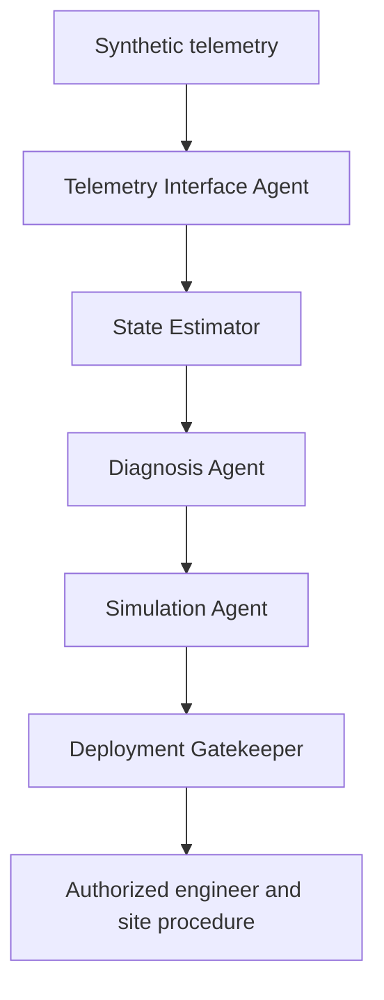

# F117 Digital Twin Engineer

F117 is the first working flagship demonstration in the Multi-Agent AI Atlas. It shows how an industrial digital twin can combine telemetry, state estimation, competing diagnoses, what-if simulation, safety review, and a protected human decision without issuing equipment commands.

## Demonstration scenario

A synthetic packaging-line motor reports elevated temperature, vibration, and current. Five specialized agents collaborate to:

1. validate the telemetry contract and provenance
2. construct the current twin state
3. rank competing failure hypotheses
4. simulate three response options
5. enforce the protected-action boundary

The lowest-risk option is a controlled stop and inspection. The reference system cannot carry it out. It records that an authorized engineer and an approved site procedure are required.

## Architecture



## Run the demonstration

From the repository root:

```bash
python systems/F117_digital_twin_engineer/demo.py
```

Record a synthetic approval to demonstrate the next controlled step:

```bash
python systems/F117_digital_twin_engineer/demo.py --approve
```

Both runs keep `command_issued` set to `false`. Approval authorizes only the use of a real organization's separate site procedure. It does not give this software equipment authority.

## Output

The JSON result contains:

- current asset condition and confidence
- timestamp and source provenance
- ranked diagnostic hypotheses
- three what-if response simulations
- recommended action and rationale
- governance state and protected-action decision
- a five-event trace of agent work
- explicit model limitations

## Fail-closed behavior

The demonstration blocks when:

- required telemetry fields are missing
- numeric telemetry is invalid
- the timestamp lacks a timezone
- telemetry is older than 120 seconds
- a protected action lacks a complete authorized-engineer approval record

## Verification

```bash
python -m pytest -q systems/F117_digital_twin_engineer/tests/test_digital_twin.py
```

The test suite covers anomaly detection, nominal behavior, stale and incomplete telemetry, approval roles, protected-action enforcement, deterministic simulations, provenance, and trace completeness.

## Demonstration and case-study assets

- [`DEMO_SCRIPT.md`](DEMO_SCRIPT.md) provides a three-minute presentation sequence.
- [`CASE_STUDY.md`](CASE_STUDY.md) defines the synthetic buyer scenario, demonstrated result, value hypotheses, implementation path, and commercial entry points.

## Operational boundary

This is a synthetic deterministic architecture demonstration. It is not a validated physics model, safety function, maintenance instruction, industrial controller, or substitute for qualified engineering judgment. It has no PLC, SCADA, robot, actuator, setpoint, or interlock interface.

Real-world use requires asset-specific models, sensor validation, cybersecurity review, site safety analysis, approved procedures, verification, and authorization by the responsible engineering and operations organization.

## Related Atlas references

- **Implementation:** [`../manufacturing_batch.py`](../manufacturing_batch.py)
- **Manufacturing specification:** [`../F111_F120_MANUFACTURING.md`](../F111_F120_MANUFACTURING.md)
- **Flagship portfolio:** [`../../business/FLAGSHIP_PORTFOLIO.md`](../../business/FLAGSHIP_PORTFOLIO.md)
